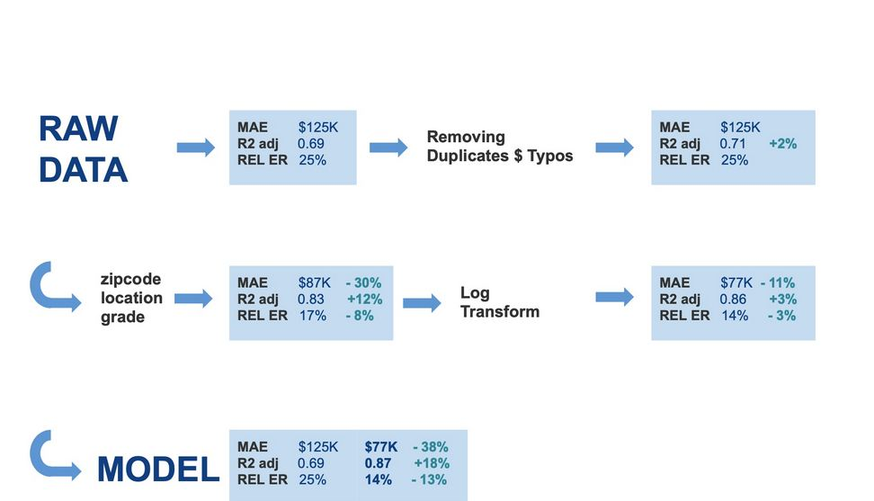

# Mid bootcamp project (Case Study: Regression)
## Anna, Manuel & Ahmed

## Objective

To build a model that will predict the sale price of houses as accurately as possible based on features provided in the dataset. This  model will help Real Estate Agents and Investors to analyze real estate features and their effect on market price.

## Dataset

The dataset consists of information on 21,000 properties with 20 unique features about data of houses sold between May 2014 to May 2015 in Washington. The dataset can be found in the file `"regression_data_clean.csv"`, in this repo. The detailed description of the column names can be found in the `"project_details_regression.md"` file in this repository. 

##  1. Exploring & Preparing the Data

- Understanding the context.
- Cleaning
- Initial correlation analysis
- Engineering new features based on location
- Location-based Feature Engineering Notebook: `regression_project_anna.ipynb` and `Regression Project Manu.ipynb`
- City-based Feature Engineering Notebook: House `price prediction - Ahmed .ipynb`

## Modeling

  

## Key Insights

1- Distance from Economic Hubs contributed most to higher prices in our  linear regression models. 

2- City name and zipcode contributed to improve our model.

3- The size of the house and the number of bedroomss and bathrooms. 

4- Final MAE was $77K.

5- Future work:
   
    - Outliers - split between property categories - product based approach
    - Zipcodes - split between popular / remote zipcodes
    - Year built/renovated  - explore further renovation

